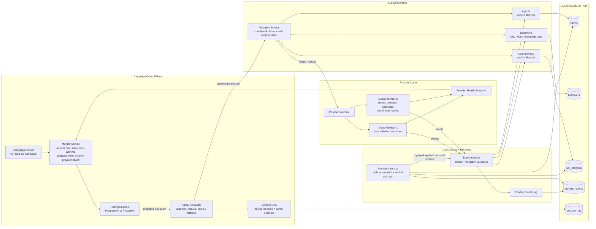
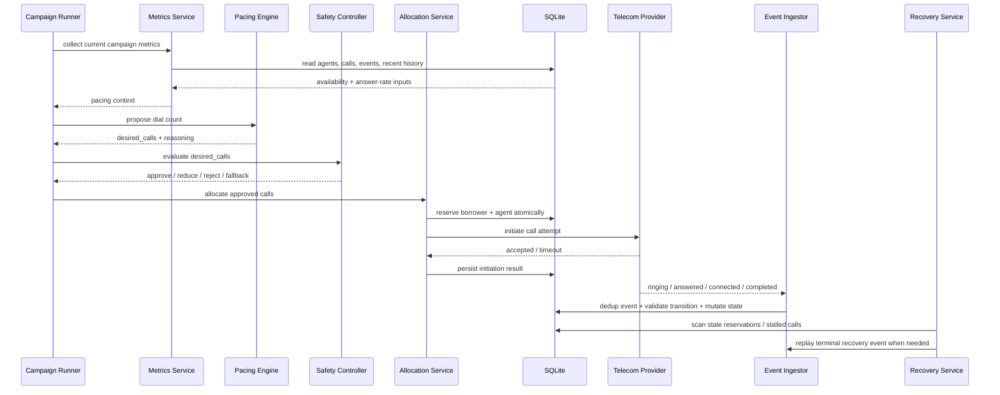
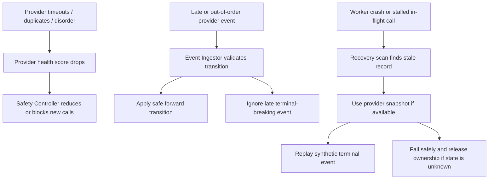

# Architecture

## Overview

This prototype keeps the system intentionally simple while still making the safety boundary, recovery path, and provider behavior explicit.

- one application process
- SQLite as the local source of truth
- explicit state machines for agents and calls
- a strict safety boundary between pacing and provider initiation
- mock providers that can emit failures, duplicates, and out-of-order events

The goal is not to mimic a full telecom platform. The goal is to demonstrate correctness, safety, and recovery under the failure modes described in the assignment.

## System Architecture

## Successful Dial Sequence

## Design Responsibilities

- `Campaign Runner`
  - owns the tick loop for a campaign
  - gathers metrics, runs pacing, applies safety, and triggers allocation
- `Metrics Service`
  - computes the inputs used by pacing and safety decisions
  - includes provider health, duplicate-event pressure, and recent answer behavior
- `ProgressivePacingEngine`
  - proposes calls from immediately available agents only
- `PredictivePacingEngine`
  - proposes calls using current availability plus imminently free wrap-up agents
- `SafetyController`
  - is the hard boundary between pacing and provider initiation
  - clamps aggressive predictions using real capacity and provider health
- `AllocationService`
  - claims agent and borrower ownership with separate atomic conditional updates
  - compensates safely if the second claim or provider initiation fails
  - creates the call attempt and initiates the provider
- `EventIngestor`
  - persists provider events
  - rejects duplicates and invalid backward transitions
  - preserves terminal call consistency
- `RecoveryService`
  - repairs stale reservations and stalled in-flight calls
  - replays recovery events through the same ingestion logic used for normal provider events

## Why the Safety Boundary Matters

The predictive engine never talks to the provider directly. It only suggests a dial count. The Safety Controller is the only component allowed to approve or reduce that suggestion before any call is initiated.

That means:

- predictive logic cannot bypass safety
- provider health can force fallback behavior
- sudden capacity loss can stop aggressive pacing quickly

## Persistence Strategy

SQLite stores:

- campaigns
- agents
- borrowers
- call attempts
- provider events
- decision logs

Even though SQLite is not the final scale choice, it gives a deterministic and inspectable source of truth for a local prototype.

## Concurrency Strategy

Agent and borrower reservation use atomic conditional updates:

- reserve only if `state = AVAILABLE`
- or reserve wrap-up agents only if `wrap_up_until <= current_tick + setup_buffer`
- treat success only if exactly one row is updated

This prevents two workers from successfully reserving the same agent or borrower.

## Failure-Control Loops

## Failure Handling

The prototype explicitly demonstrates:

- stale reservation expiry
- worker crash recovery
- duplicate provider events
- out-of-order provider events
- provider timeout / outage degradation
- sudden agent availability drops

## Expected Scaling Bottlenecks

The first things to break at larger scale are:

- SQLite write contention
- full-table reconciliation scans
- single-process provider event ingestion

The first upgrades would be:

- PostgreSQL instead of SQLite
- queue-backed work distribution
- campaign partitioning
- dedicated event ingestion workers
