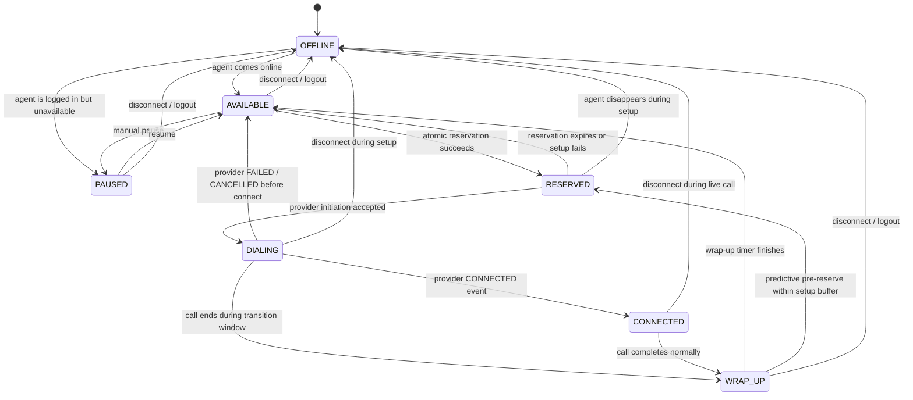
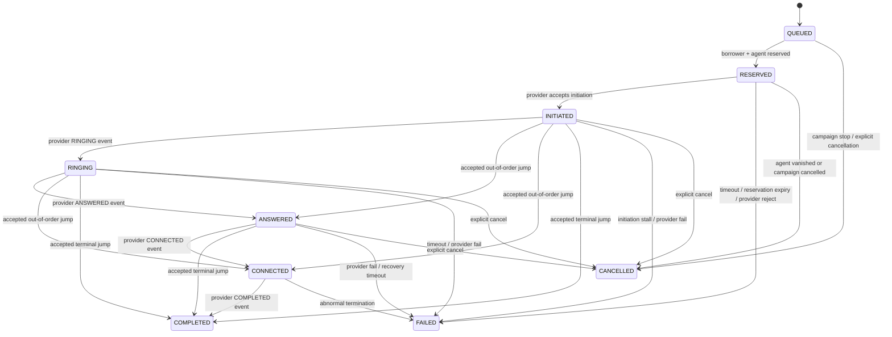
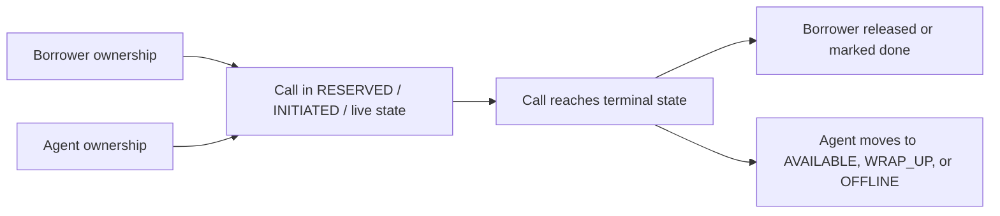

# State Machines

## Agent State Machine

### Agent State Intent

- `OFFLINE`
  - agent is unusable for dialing
- `AVAILABLE`
  - agent can be reserved immediately
- `RESERVED`
  - ownership has been claimed, but the call is not yet fully initiated
- `DIALING`
  - provider accepted the attempt and the call is in setup / ringing stages
- `CONNECTED`
  - borrower and agent are live on the call
- `WRAP_UP`
  - post-call cooldown before the agent becomes fully available again
- `PAUSED`
  - agent is intentionally not dialable

### Agent Design Notes

- `WRAP_UP -> RESERVED` is the key transition that allows safe predictive behavior without bypassing real capacity.
- Agents are never considered reusable just because a forecast says they should be free soon. The system requires either `AVAILABLE` or a wrap-up completion time inside the allowed setup buffer.
- Losing the agent during setup does not silently continue the call attempt. The system cancels or fails the call path and preserves consistency.

## Call State Machine

### Call State Intent

- `QUEUED`
  - logical candidate before ownership is taken
- `RESERVED`
  - borrower and agent ownership exist, but the provider has not accepted the attempt yet
- `INITIATED`
  - provider accepted the call attempt
- `RINGING`
  - phone is ringing
- `ANSWERED`
  - provider claims the borrower answered, but the agent may not be bridged yet
- `CONNECTED`
  - the borrower and agent are in the live call
- `COMPLETED`
  - successful terminal completion
- `FAILED`
  - terminal failure
- `CANCELLED`
  - terminal cancellation before or during setup

### Call Design Notes

- Direct jumps like `INITIATED -> COMPLETED` are allowed because real providers may send partial, duplicate, or out-of-order event sequences.
- Terminal states stay terminal. Late `ANSWERED` or `RINGING` events after `COMPLETED` are recorded for auditability but do not mutate the call.
- Recovery never bypasses the state machine. It synthesizes a terminal event and reuses the same ingestion path to preserve consistency rules.

## Event Ordering Rules

- The first non-duplicate event with a valid transition wins.
- Duplicate provider events are stored and marked as duplicates.
- Impossible backward transitions are rejected.
- Late events for terminal calls do not mutate state.

## State Ownership Summary

### Reviewer Takeaway

- The agent state machine protects capacity.
- The call state machine protects event consistency.
- The Safety Controller sits above both and ensures predictive behavior cannot bypass hard limits.
